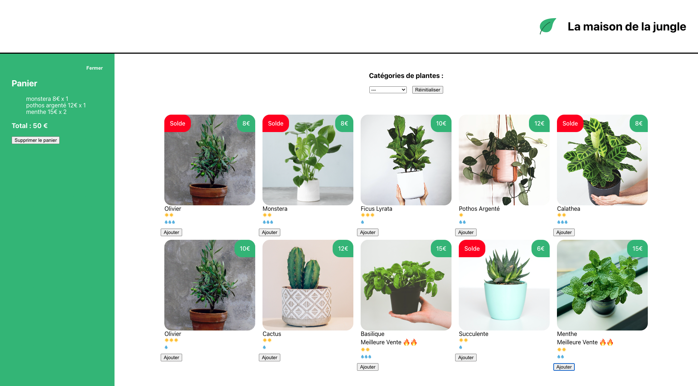

# Projet Maison Jungle : Apprentissage de React avec OpenClassrooms

Ce projet a été conçu dans le cadre de l'apprentissage de React avec OpenClassrooms. L'objectif principal de ce projet est d'apprendre les concepts fondamentaux de React en créant une application interactive appelée "Maison Jungle". Le projet met l'accent sur l'acquisition des compétences suivantes :

## Objectifs d'Apprentissage

1. **Compréhension de la Logique React :** Ce projet vise à développer une solide compréhension de la logique de React, y compris les concepts de composants, d'état, de propriétés, de cycle de vie et de rendu conditionnel.

2. **Modularité avec les Composants en JSX :** En utilisant JSX (JavaScript XML), vous apprendrez à créer des composants réutilisables et modulaires. Vous découvrirez comment structurer votre application en décomposant l'interface utilisateur en morceaux faciles à gérer.

3. **Intégration de Style et d'Assets :** Vous explorerez comment incorporer du style dans vos composants en utilisant des approches telles que les classes CSS, les modules CSS et les bibliothèques de styles comme Tailwind CSS. Vous apprendrez également à incorporer des images et d'autres actifs dans votre projet.

## Fonctionnalités de la "Maison Jungle"

- **Affichage des Plantes :** L'application affiche une variété de plantes d'intérieur, chacune avec son nom, une image et des détails pertinents.

- **Gestion des Plantes :** Vous pouvez ajouter de nouvelles plantes à la maison jungle et gérer leur état, par exemple, indiquer si elles ont besoin d'être arrosées.

- **Personnalisation de l'Environnement :** Vous pourrez explorer comment ajuster les styles et l'apparence de l'application pour créer une atmosphère cohérente avec le thème de la "Maison Jungle".

## Capture d'Écran

## Mise en Route

1. Suivez les instructions fournies par OpenClassrooms pour mettre en place votre environnement de développement React.
2. Téléchargez les fichiers du projet "Maison Jungle" depuis le dépôt fourni par OpenClassrooms.
3. Installez les dépendances avec `yarn install`.
4. Lancez l'application avec `yarn start`.

## Ressources Utilisées

-  [React](https://reactjs.org/) pour le développement de l'interface utilisateur.
- Styles CSS pour la personnalisation de l'apparence.
- Actifs d'images pour les plantes et les éléments de la maison jungle.

## Contributions

Ce projet est destiné à des fins d'apprentissage et est suivi selon les directives d'OpenClassrooms. Les contributions externes ne sont pas prises en compte pour ce projet.

## Licence

Ce projet fait partie d'un programme d'apprentissage avec OpenClassrooms et suit leurs directives d'utilisation.

---

Ce projet a été créé dans le cadre de l'apprentissage de React avec OpenClassrooms. En suivant les objectifs d'apprentissage, vous avez acquis des compétences clés pour développer des applications React modulaires, incorporer du style et des actifs, tout en explorant le concept de "Maison Jungle".
